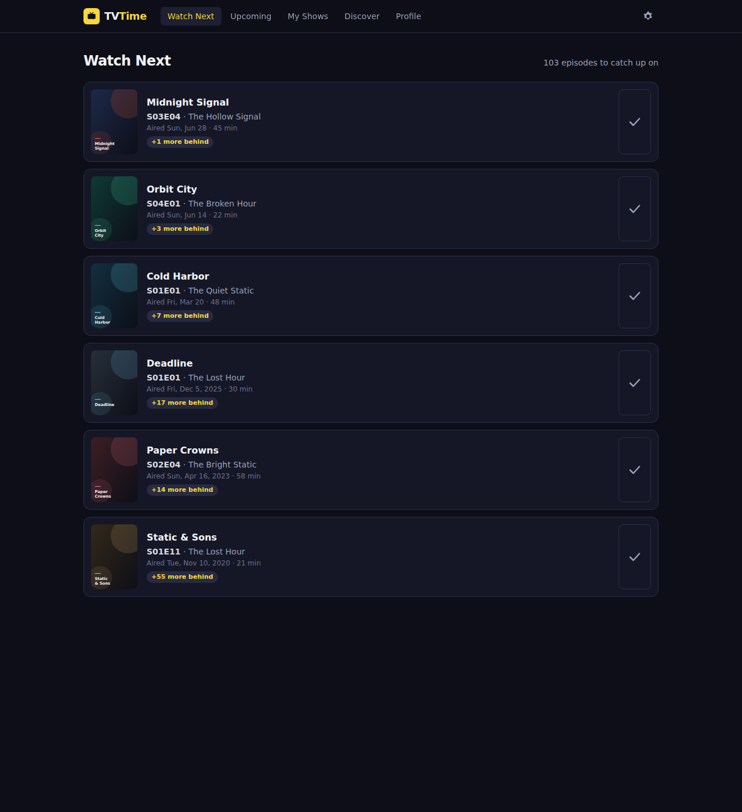

# TV Time

A personal, self-hosted recreation of the TV Time app: track the shows you
watch, see when new episodes air, and catch up on the ones you've missed.
Built as an installable web app (PWA) with your data stored locally in SQLite —
no accounts, no cloud, nothing to shut down on you.



## Features

- **Watch Next** — the next unwatched episode of every show you follow, with
  "behind by N" counts so you always know what you've missed.
- **Upcoming** — an agenda of announced episodes for the next 90 days, plus an
  iCalendar feed (`/api/calendar.ics`) you can subscribe to from Google or
  Apple Calendar.
- **My Shows** — your library, bucketed like TV Time: Watching, Up to date,
  Not started, Finished, Archived — with per-show progress bars.
- **Full episode tracking** — mark episodes, whole seasons, or everything up
  to a point as watched; spoiler protection blurs descriptions of unwatched
  episodes.
- **Discover** — search TVmaze's catalog of 80,000+ shows and follow anything
  in one click.
- **Profile stats** — total time watched, episodes per month, most-watched
  shows, top genres.
- **TV Time import** — upload the data export from the original app
  (zip or CSVs) and your followed shows + watch history carry over.
- **Episode notifications** — real Web Push: when a new episode of a show you
  follow airs, every enrolled device gets a notification, even with the app
  closed. Several episodes at once collapse into a single digest.
- **PWA** — installable to your phone's home screen, with offline caching of
  the last-seen data.

## Data sources

- **[TVmaze](https://www.tvmaze.com/api)** (no key needed) provides show
  metadata, episode lists, and air dates. Works out of the box.
- **[TMDB](https://developer.themoviedb.org)** (optional, free key) adds
  higher-quality posters/backdrops and exact episode matching for classic
  TV Time exports. Add your key in **Settings**.

## Getting started

```bash
npm install
npm run build
npm start          # http://localhost:3000
```

Or for development: `npm run dev`.

Your library lives in `data/tvtime.db` (SQLite). Back that file up and you've
backed up everything. Set `TVTIME_DATA_DIR` to store it elsewhere.

## Importing your TV Time history

1. In the original TV Time app: Settings → Manage account → Export your data
   (or use the GDPR export they email you).
2. In this app: **Settings → Import from TV Time** and upload the zip (or the
   CSVs inside it).
3. Shows are matched via their TVDB ids (exact); watched episodes are matched
   by season/episode number when the export includes them. Classic exports
   only carry TVDB *episode* ids — add a TMDB key first and those are resolved
   exactly too; without one, the importer approximates by marking the first N
   aired episodes of each show.

Both export generations TV Time has shipped are supported
(`seen_episode.csv` / `followed_tv_show.csv` with TVDB ids, and the newer
show-name + season/episode CSVs). Column headers are sniffed, so minor format
variations are fine.

## Episode notifications

Enable them per device in **Settings → Episode notifications** (there's a
test button). A background job checks every 5 minutes for episodes that just
aired, keeps air dates synced, and pushes straight to your devices — no
third-party service; VAPID keys are generated automatically on first use.

- **iPhone/iPad**: install the app to your Home Screen first (Share → Add to
  Home Screen), then enable notifications from inside it (iOS 16.4+).
- Web Push requires a secure context: `localhost` works out of the box;
  anything else needs HTTPS.
- Tuning via env vars: `PUSH_CHECK_MINUTES` (default 5),
  `PUSH_LOOKBACK_HOURS` (default 12 — how far back "just aired" reaches),
  `VAPID_SUBJECT` (a `mailto:` contact some push services require).

## Development

```bash
npm test           # unit tests (importer parsing, category logic)
TV_API_MOCK=1 npm run dev   # run against a deterministic offline fixture
                            # universe — no network needed
```

`TV_API_MOCK=1` replaces TVmaze/TMDB with 8 generated shows whose air dates
are relative to "today", which makes Watch Next / Upcoming / behind-counts
exercisable at any time (this is how the app is tested in CI-like sandboxes).

## Notes

- Single-user by design: there is no auth. If you expose it beyond localhost,
  put it behind a reverse proxy with auth (e.g. Tailscale, basic auth).
- Specials (season 0) are currently skipped to keep progress counts coherent.
